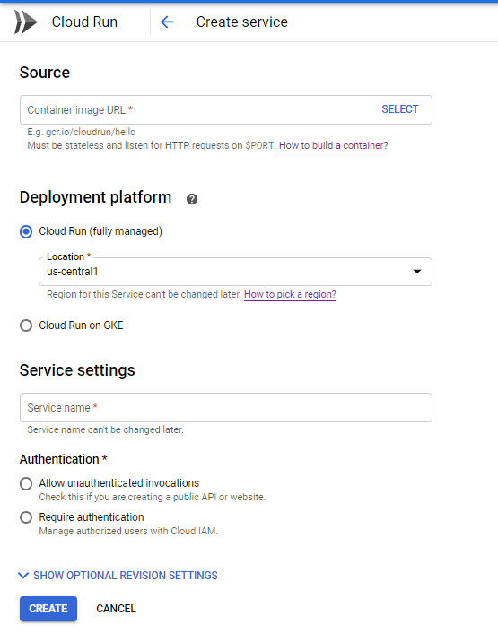
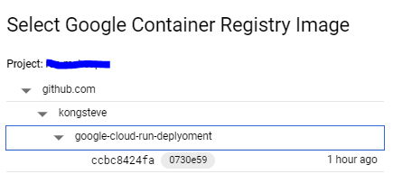
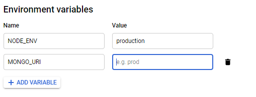
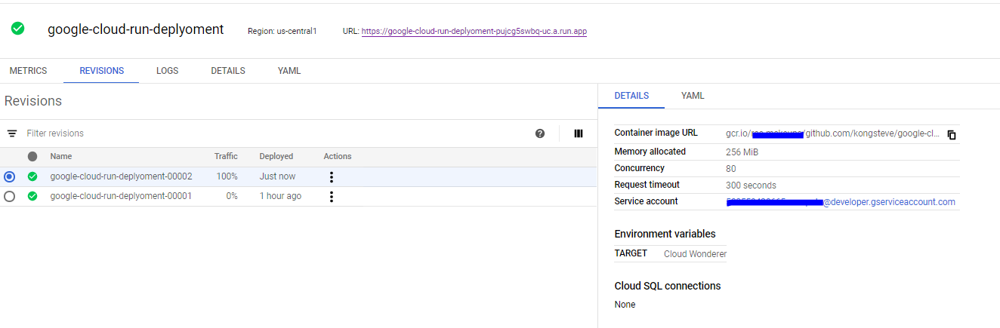

# Google Cloud Run Deployment
This is a test run on how to use google cloud platform tools (Cloud Run and Cloud Build) to deploy an application
## App overview
This a simple NodeJs web server application using Express  to return a String that has the environment variable `TARGET` and the current date.

https://google-cloud-run-deplyoment-pujcg5swbq-uc.a.run.app -> Link to the application
## The process

### Step 1 : Create you application
>Ensure it is stateless 

>> Consider using Database as a Service (passing a connections string as Environment Variable).
>>Conside the following architecture: `Web Browser (has state) <-> Web Server (stateless) <-> Database (has state)`

### Step 2 : Create you Dockerfile/Cloud build file
>This is used by the Cloud Build too on GCP create container image.Cloud Run used this image to deploy an application
>There are Varrious way you cloud build your image
>>1. Give Cloud Build on GCP access to your github repository by setting up a trigger on git push.The trigger could be set for **all branches** or **for a specific branch** or **branch that matches a regular expresssion(regex)**
>>2. Build the image locally and push the image to the GCP Cloud registry page.This is done by install Google Cloud SDK tools(including beta components).

### Step 3 : Deploy on cloud run

> 1. Create a new service
>>>> 

>> It will take you to the page below

>>>> 

> 2. on **Source** select your image that you uploaded either through Cloud Build or Locally
>>>> 

>3. Select your Deployment platform - this is either fully managed or to a kurbernetes engine cluster .Click the link to find out more 
[Cloud Run vs Cloud Run on GKE](https://www.youtube.com/watch?v=RVdhyprptTQ)

>4. Enter Service settings name (usually it is autogenarated based on you repository name)
>5. Choose authentication

>6. Add your Environment Variables

>>>>

>7. Once you are satisfied with you settings/configuration . Hit Create

>8. Once created, you will see you application depoyed and a `URL for your applications`

>>>> 